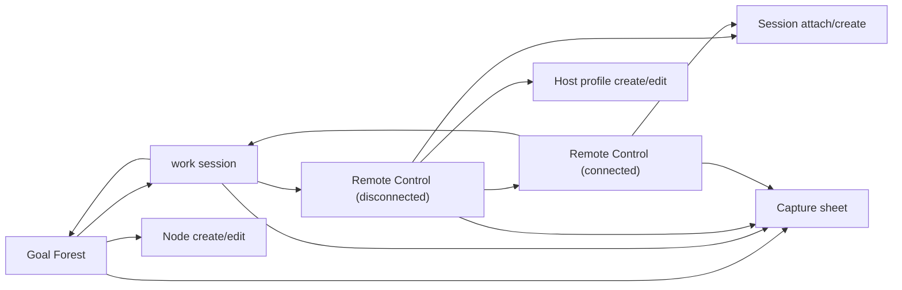

# Transition map

## Status
Active

## Date
2026-04-07

## Purpose

Make the current `0.1.0` IA operational by describing the minimum transitions among screens and overlays.

This note is about movement, not final visual design.

## Transition stance

The current recommended stance is:

- use screen transitions for sustained work states
- use overlays for quick branching actions
- preserve short return paths when the user moves from orientation to execution and back

## Primary screen graph

## Core transition rules

### Rule 1 — `Goal Forest` to `work session`

This is a primary transition, not a side action.

Use when:

- the user chooses a linked session
- the user starts a new session from a node or nearby context

Expectation:

- the session becomes the dominant content state
- `Goal Forest` shrinks into supporting context rather than disappearing conceptually

### Rule 2 — `work session` to `Remote Control`

This is a primary transition when remote work is part of the current session.

Use when:

- the user launches remote work from the session

Expectation:

- the remote view carries session linkage forward
- returning to the session should feel short and obvious

### Rule 3 — `Remote Control` disconnected to connected

This is a within-tab screen-state transition, not a separate branch of the product.

Use when:

- the user chooses a host and connects

Expectation:

- the dominant content shifts from host selection to active terminal/file-transfer work
- session attachment remains visible before and after the connection

### Rule 4 — `Remote Control` back to `work session`

This should be especially short when the remote flow began from a session.

Use when:

- the user finishes or pauses remote work
- the user wants to preserve or inspect continuity in the session

Expectation:

- host, recency, transfers, and short human note remain available in the session

## Overlay transition rules

### Capture sheet

May open from:

- `Goal Forest`
- `work session`
- `Remote Control` disconnected
- `Remote Control` connected

Dismisses back to:

- the invoking screen

### Session attach / create sheet

May open from:

- `Remote Control` disconnected
- `Remote Control` connected

Dismisses back to:

- the current remote state

Why:

- attaching work to a session is important, but it should not eject the user from the remote workflow

### Node create / edit sheet

May open from:

- `Goal Forest`

Dismisses back to:

- the same local forest context

Why:

- node editing should preserve spatial and relational context

### Host profile create / edit sheet

May open from:

- `Remote Control` disconnected

Dismisses back to:

- host selection / disconnected remote state

Why:

- host management supports remote use but should not become its own world

## Entry-point map

The current expected first-version entry points are:

- shell -> `Goal Forest` tab
- shell recent-session affordance -> `work session`
- shell -> `Remote Control` tab
- global floating create button -> capture sheet

This keeps the shell simple while still allowing quick return to active work.

## Guardrails

- Do not introduce a `Home` transition just to hold shortcuts.
- Do not route quick capture through a separate screen.
- Do not make session attachment require abandoning the remote flow.
- Do not require full `Goal Forest` navigation every time the user wants execution context.

## Minimum implementation reading

If this note needs to collapse into the shortest useful statement, the minimum is:

- `Goal Forest` <-> `work session` and `work session` -> `Remote Control` are the key screen transitions
- `Remote Control` disconnected -> connected is a major within-tab state change
- capture and attach/create flows stay as overlays that return to the invoking screen

## Remaining open questions

- Should the shell expose a direct path from `Goal Forest` to `Remote Control`, or is session-mediated remote work the preferred default?
- In a connected remote state, should "return to session" stay in the main header, or can it live in a smaller contextual affordance?
