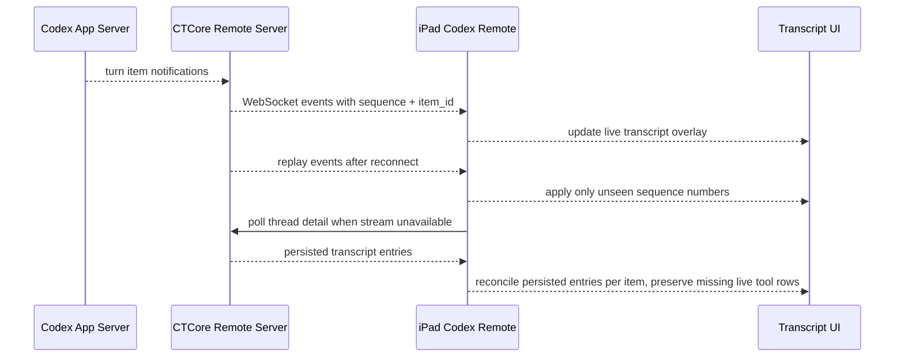

# Codex Message List Experience

## Objective & Hypothesis

Confirm and sequence the issues from GitHub issue #1, "codex消息列表体验优化", into small repair slices for the Codex Remote message list.

Working hypothesis: the highest-risk failures are not visual polish; they are transcript truth failures around live turn projection, final thread reconciliation, and interrupted stream recovery. Once those are stable, grouping, details, copying, and rich rendering can be shaped as UI slices without hiding execution state.

## Input Type

Reality plus Intent.

The issue mixes observed defects:

- tool calls disappear after a turn ends
- interrupted streaming is not recovered even when the turn continues

and desired behavior:

- group similar tool calls
- allow text selection and copy
- show tool-call details
- render Markdown, especially code blocks and Mermaid diagrams

## Active Mode

Diagnose, then Execute one slice at a time.

Do not start implementation before the specific slice is approved.

## Governing Anchors

- `AGENTS.md`
- `clients/apple/AGENTS.md`
- `clients/apple/iPad/AGENTS.md`
- `docs/00-meta/input-reality.md`
- `docs/00-meta/input-intent.md`
- `docs/00-meta/mode-d-diagnose.md`
- `docs/00-meta/mode-c-execute.md`
- `docs/20-product-tdd/claim-realization-matrix.md`
- `docs/20-product-tdd/unit-topology.md`
- `docs/20-product-tdd/system-state-and-authority.md`
- `tasks/0015-codex-remote-rich-message-rendering/README.md`

## Confirmed Issue Split

Issue #1 currently contains six separate concerns:

1. Group similar tool calls.
2. Allow selecting and copying text.
3. Show tool-call details.
4. Keep turn tool calls visible after the turn ends.
5. Render Markdown, especially fenced code blocks and Mermaid diagrams.
6. Recover when streaming drops while the turn is still running.

Markdown/code/Mermaid already has a focused packet and first implementation in `tasks/0015-codex-remote-rich-message-rendering/README.md`. This packet should treat it as a verification/polish dependency, not restart that work.

## Current Evidence

- `CodexRemoteTranscript` renders persisted typed transcript entries, then live typed stream entries, then a fallback streaming assistant row.
- Live messages are filtered out when their IDs already exist in persisted messages.
- `reconcileStreamIfNeeded` clears all live stream projection when it sees a completed assistant message for the turn.
- Before Slice 3, `eventRow` was a simple `DisclosureGroup` with flattened text; event text had selection enabled, but conversation rich Markdown and whole-row copy affordances were not guaranteed.
- Before Slice 3, CTCore flattened app-server items into `ThreadMessage { role, kind, text, status, phase, created_at }`; Slice 3 removed that flat message contract.
- CTCore publishes live item updates from app-server notifications, but the client stream error path only sets status to `polling`; it does not actually reconnect or poll until terminal state.
- Codex app-server already exposes typed `Turn.items` and item lifecycle notifications. See `tasks/0016-codex-message-list-experience/app-server-tool-call-findings.md`.

## Repair Sequence

### Slice 1 - Preserve Tool Calls After Turn Completion

Problem: live tool rows can disappear when the stream finishes and the thread detail refresh replaces or clears live projection before persisted detail has equivalent tool entries.

Plan:

- Add a turn-scoped live transcript overlay in the iPad runtime that keeps assistant/tool/event items by stable item ID.
- Reconcile live items individually against `threadDetailResponse.transcript_entries`, instead of clearing every live item when any assistant message for the turn exists.
- Keep live tool/event rows visible until persisted detail contains matching IDs or the turn reaches a terminal state and a final detail refresh confirms equivalent persisted rows.
- If CTCore final thread detail lacks tool rows that were seen during streaming, keep the recent live rows as an explicitly local projection for that selected thread.

Verification:

- Unit-test or fixture-test reconciliation with: assistant persisted, streamed command still absent, command remains visible.
- UI smoke path: submit a turn with command execution; verify command/tool row remains after `turn_completed` and detail reload.

### Slice 2 - Recover Interrupted Streaming

Problem: when WebSocket streaming fails mid-turn, the client labels the state as `polling` but does not retry the WebSocket or poll final thread state.

Plan:

- Track the highest stream sequence handled for the active turn.
- Retry the WebSocket with bounded backoff while the turn is not terminal.
- Use server replay to rebuild missed events, ignoring already-applied sequence numbers.
- After repeated WebSocket failure or an unavailable stream, poll `GET /threads/:thread_id` until the selected turn reaches a terminal status or a timeout budget is reached.
- During polling, update the same live transcript overlay from thread detail so the UI does not freeze on stale text.

Verification:

- Client-level test seam or manual smoke with a forced WebSocket close after some events.
- Expected result: status moves through reconnecting/polling, transcript continues to update or finalizes from thread detail, and no duplicate streamed rows appear.

### Slice 3 - Show Tool-Call Details

Status: implemented in this slice.

Problem: CTCore currently gives the UI flattened `text`, so the UI cannot present concise labels plus inspectable details. More importantly, the code does not model the transcript's real shape clearly enough: conversation messages and tool activity are different things, but command execution, MCP/dynamic tool calls, web search, file changes, and image generation all belong to the same broader `ToolCallMessage` family.

Plan:

- Introduce a small typed transcript model instead of growing optional fields on the flat message:
  - `UserMessage`
  - `AssistantMessage`
  - `ToolCallMessage`
  - `GenericEventMessage`
- Model command execution, MCP/dynamic/collab tool calls, web search, file changes, and image generation as `ToolCallMessage` variants or payload kinds, not as separate top-level message implementations.
- Keep shared envelope data separate from typed payload data: id, turn id, status, phase, and created time belong to the envelope; command output, tool name, prompt, arguments/result, web query/url, file changes, and image result belong to `ToolCallMessage` payloads.
- In CTCore, parse app-server items into typed variants close to the adapter boundary so the rest of the server is not forced to reason about raw JSON plus stringly typed `kind` checks.
- In the iPad client, decode into a typed transcript entry or immediately project the wire payload into one. SwiftUI rendering should switch on the type, not on ad hoc combinations of `role` and `kind`.
- Preserve a readable fallback for unknown item kinds, but keep that fallback visibly isolated as `generic event` instead of letting it blur the known message types.
- Render tool-call rows with a compact summary. Open structured details in a popover so the transcript does not expand in place. Details remain selectable and copyable.

Verification:

- Passed: `cargo test --manifest-path CTCore/Cargo.toml --features codex-remote-control-server`
- Passed: `xcodebuild -project clients/apple/CraftingTable.xcodeproj -scheme CraftingTable -configuration Debug -destination 'id=BEC303B0-A080-4E5E-9DD8-A297D0B0200E' build`

Implementation notes:

- CTCore now returns only `transcript_entries`; the legacy flat `messages` field and `ThreadMessage` model were removed.
- `transcript_entries` uses top-level `user_message`, `assistant_message`, `tool_call_message`, and `generic_event_message`.
- `tool_call_message.payload.kind` preserves app-server tool-like item kinds such as `commandExecution`, `fileChange`, `mcpToolCall`, `dynamicToolCall`, `collabAgentToolCall`, `webSearch`, `imageView`, and `imageGeneration`.
- Turn stream `item_updated` events now include the same typed `transcript_entry` when the source item can be projected.
- The iPad transcript renders typed entries directly and does not decode or fall back to legacy messages.
- Tool-call rows now show a compact summary. Tapping a row opens structured details in a popover, with detail text selectable and copyable from both the row context menu and the popover header.

Follow-up:

- If the Swift transcript DTOs grow further, move them out of `CodexRemoteClient.swift` into a dedicated Codex Remote transcript model file.

### Slice 4 - Group Similar Tool Calls

Problem: one row per tool call is noisy during active turns and after persisted detail loads.

Plan:

- Introduce a local transcript-entry projection in the iPad UI:
  - conversation message entry
  - single tool-call entry
  - grouped tool-call entry
  - generic event entry
- Treat Codex app-server as the source of item semantics: preserve `Turn.items` order, typed item payloads, and live `threadId`/`turnId`/`itemId` lifecycle notifications in CTCore.
- Do not assume or invent a group id. Current app-server evidence shows ordered typed items, not an explicit tool-call group contract.
- Group adjacent `ToolCallMessage` entries within the same turn when their payload kinds are compatible, preserving chronological order inside the group.
- If a future app-server protocol exposes a stronger batch boundary, preserve that boundary in CTCore and render it directly.
- Do not group user or assistant messages.
- Default collapsed state should show kind, count, latest status, and timestamp; expanded state shows each item with details.

Verification:

- Pure Swift projection tests if feasible; otherwise a focused preview/sample data path.
- Smoke examples: multiple adjacent MCP tool calls group together; command execution and file change do not merge into one ambiguous row unless a real source grouping signal says they belong together.

### Slice 5 - Selection And Copy

Status: selectable Markdown message bodies implemented; row-level copy actions remain follow-up.

Problem: event text and code blocks are selectable, but the whole transcript does not have a consistent selection/copy model.

Plan:

- Enable fine-grained text selection for assistant/user rich message bodies while preserving Markdown rendering. Done with reusable `CodexRemoteSelectableMarkdownText`, a `UITextView`-backed renderer used by `CodexRemoteMarkdownBlockView`, because SwiftUI/MarkdownUI selection selected the whole message rather than an arbitrary text range.
- Add explicit copy actions for message rows, tool rows, grouped tool entries, and code blocks.
- Copy actions should copy the underlying plain text/detail text, not accessibility labels or truncated UI text.
- Keep visual affordance small: icon button or context menu, not extra explanatory text.

Verification:

- Manual iPad smoke: copy assistant text, user text, code block, single tool detail, grouped tool detail.
- Confirm copied text preserves line breaks for commands and code.

### Slice 6 - Markdown Rendering Verification

Problem: issue #1 requested Markdown/code/Mermaid rendering, but this has already been worked in packet 0015 and should be verified as part of the final issue closeout.

Plan:

- Reuse `CodexRemoteRichMessageText`, `CodexRemoteMarkdownBlockView`, `CodexRemoteCodeBlockView`, and `CodexRemoteMermaidBlockView`.
- Verify code blocks, incomplete streaming fences, Mermaid success, and Mermaid failure fallback.
- Fix only gaps found during verification; do not redesign the renderer in this packet unless 0015 evidence proves the boundary is wrong.

Verification:

- Build the iPad target.
- Manual sample transcript covering prose, lists, fenced Swift/JSON/shell code, Mermaid, and malformed Mermaid.

## Sequence Diagram

## Guardrails Touched

- Keep product behavior honest: do not imply a tool row is durable if it is only a local live projection.
- Keep CTCore as the server contract owner for app-server item adaptation.
- Keep Codex Remote as the iPad owner for transcript grouping, copy affordances, and active stream projection.
- Avoid broad renderer rewrites; Markdown/code/Mermaid belongs to the existing 0015 packet unless verification finds a concrete defect.

## Verification

Packet verification:

- Confirm issue #1 contents through GitHub.
- Confirm current code paths in `CodexRemoteThreadPage`, `CodexRemoteScreen`, `CodexRemoteClient`, and CTCore app-server adapter.
- Confirm rich rendering prior work in packet 0015.

Implementation verification, per slice:

- CTCore tests for contract/detail mapping changes.
- Swift projection/reconciliation tests where the current target structure allows them.
- iPad target build after each implementation slice.
- Manual smoke for live turn execution, stream interruption, selection/copy, grouped tool activity, and Markdown/code/Mermaid examples.

## Promotion Candidates

- If transcript entry grouping becomes stable product behavior, promote a concise claim to PRD.
- If the message/detail fields become a reusable contract, preserve them in Product TDD or contract tests rather than expanding docs first.
