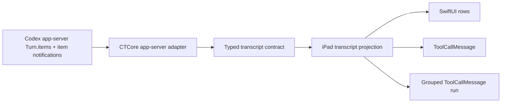

# App Server Tool-Call Findings

## Purpose

Record the source evidence for Slice 3 and Slice 4 before changing CTCore or the iPad client.

Question under test: should the Codex Remote transcript invent local top-level message classes for every tool shape, or should it preserve Codex app-server item semantics and project those into a smaller transcript model?

## Evidence Collected

Generated the local Codex app-server protocol schema from the installed desktop Codex binary:

```sh
codex app-server generate-ts --experimental --out tasks/0016-codex-message-list-experience/generated-app-server-schema/ts
codex app-server generate-json-schema --experimental --out tasks/0016-codex-message-list-experience/generated-app-server-schema/json
```

Codex version observed during the investigation:

```sh
codex-cli 0.133.0
```

The generated protocol shows that app-server `Turn` already owns an ordered typed item stream:

```ts
export type Turn = {
  id: string,
  items: Array<ThreadItem>,
  itemsView: TurnItemsView,
  status: TurnStatus,
  error: TurnError | null,
  startedAt: number | null,
  completedAt: number | null,
  durationMs: number | null,
};
```

`ThreadItem` is already an internally-tagged union. Relevant item types include:

- `userMessage`
- `agentMessage`
- `commandExecution`
- `fileChange`
- `mcpToolCall`
- `dynamicToolCall`
- `collabAgentToolCall`
- `webSearch`
- `imageView`
- `imageGeneration`
- review, reasoning, plan, hook, and context event types

The live notification surface also keeps item identity and turn identity:

- `item/started` carries `{ item, threadId, turnId, startedAtMs }`
- `item/completed` carries `{ item, threadId, turnId, completedAtMs }`
- `item/agentMessage/delta` carries `{ threadId, turnId, itemId, delta }`
- `item/commandExecution/outputDelta` carries `{ threadId, turnId, itemId, delta }`
- `item/fileChange/patchUpdated` carries `{ threadId, turnId, itemId, changes }`
- `item/mcpToolCall/progress` carries `{ threadId, turnId, itemId, message }`

A read-only `thread/read` probe against the current conversation returned turns with `itemsView: "full"` and ordered `items`. Tool item IDs were stable app-server item IDs such as `call_*`. No explicit group id or batch id was observed.

A wider read-only scan of recent local threads found turns with adjacent tool-call runs, for example adjacent `mcpToolCall` items after an assistant message and adjacent `fileChange` items inside a single turn. This supports grouping as a transcript projection over ordered app-server items, not as a separate source contract.

## Pre-Slice 3 Local Flattening

Before Slice 3, CTCore collapsed this typed source model into:

```rust
pub struct ThreadMessage {
    pub id: String,
    pub turn_id: String,
    pub role: String,
    pub kind: String,
    pub text: String,
    pub status: Option<String>,
    pub phase: Option<String>,
    pub created_at: Option<String>,
}
```

The iPad UI then rendered rows by checking `role` and `kind`. This lost structured fields that are needed for readable details:

- command `cwd`, `source`, parsed `commandActions`, `exitCode`, and `durationMs`
- MCP `server`, `tool`, `arguments`, `result`, `error`, and `durationMs`
- dynamic tool `namespace`, `tool`, `arguments`, `contentItems`, and `success`
- file change paths and patch status
- web search query/action
- image generation prompt/result/path

## Recommended Shape

Use a small top-level transcript model:

- `UserMessage`
- `AssistantMessage`
- `ToolCallMessage`
- `GenericEventMessage`

`ToolCallMessage` should have payload kinds for the app-server tool-like item types:

- `commandExecution`
- `fileChange`
- `mcpToolCall`
- `dynamicToolCall`
- `collabAgentToolCall`
- `webSearch`
- `imageView`
- `imageGeneration`

Do not promote `CommandExecutionMessage`, `WebSearchMessage`, or `FileChangeMessage` into separate top-level message implementations. They are variants of `ToolCallMessage`.

## Slice 3 Outcome

Slice 3 adopted the recommended shape as the only thread detail contract:

- CTCore returns `transcript_entries` and no longer returns legacy flat `messages`.
- `ThreadMessage` and `CodexRemoteThreadMessage` were removed.
- The iPad client decodes `UserMessage`, `AssistantMessage`, `ToolCallMessage`, and `GenericEventMessage` directly.
- Tool-like app-server items remain payload kinds under `ToolCallMessage`.
- Unknown source items stay visible as `GenericEventMessage`.

## Grouping Conclusion

There is no evidence of a real app-server `groupId`, and the implementation should not invent one.

"Source-level grouping" for this slice means:

1. CTCore preserves app-server `Turn.items` order, item identity, and typed item payloads close to the adapter boundary.
2. Live updates preserve the same `threadId`, `turnId`, and `itemId` lifecycle semantics from app-server notifications.
3. The client or shared projection layer folds contiguous `ToolCallMessage` entries within the same turn when their payload kinds are compatible.
4. User and assistant messages break a tool group.
5. Unknown item kinds stay visible as `GenericEventMessage` and do not silently merge into tool groups.

If a future app-server protocol exposes a stronger batch boundary, CTCore should preserve it. With the current protocol evidence, the correct grouping input is the app-server typed item sequence, not a synthetic id field.

## Projection Topology



## Follow-Up Questions

- Whether grouping should live only in the iPad client or in a shared CTCore projection. Given grouping is mostly presentation, the first implementation should prefer the iPad projection unless another client needs the same behavior immediately.
- Whether `plan`, `reasoning`, `hookPrompt`, and review mode items should be modeled as `GenericEventMessage` first or receive named event payloads in the same pass.
