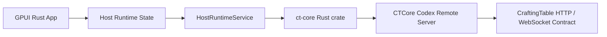

# CTCore Windows boundary

## Boundary Statement

The Windows client should be a native Windows application. CTCore remains the portable backend boundary. The client does not reimplement Codex Remote server semantics, and CTCore does not own Windows UI or OS lifecycle concerns.

## Target Topology

Path C is selected.

## Ownership Split

Windows client owns:

- GPUI views, styling, commands, and status presentation.
- Window lifecycle, tray/background behavior, launch-at-login, notifications, installer/update path, and packaging.
- Windows credential store integration and platform filesystem locations.
- User-facing runtime settings such as bind mode, Codex home display/editing, and local-network exposure controls.
- App-side state machine and event log for Host Runtime status.
- Directly owning CTCore runtime task lifecycle and translating runtime errors into UI state.

CTCore owns:

- Codex Remote Server routes, models, WebSocket events, and contract normalization.
- codex-app server adaptation and host-local Codex process behavior.
- In-process Host Runtime server implementation.
- Rust server runtime API used by the Windows client.
- Stable native C ABI remains available for non-Rust hosts, but it is not the selected Windows path.

Build tooling owns:

- Building the Rust native Windows app and CTCore in one Cargo dependency graph.
- Keeping generated or binary artifacts out of git.
- Preserving a smoke-test path for Host Runtime start, health, stop, and port release.

## Candidate Integration Paths

### Path A - WinUI 3 + C ABI DLL

Viable but not selected.

Use C# WinUI 3 for the app and call `ct_core.dll` through .NET native interop. This matches native Windows UI expectations and keeps the CTCore boundary narrow.

Required CTCore work:

- Ensure `ct_codex_remote_server_start`, `ct_codex_remote_server_stop`, and `ct_codex_remote_server_string_free` are exported from the Windows DLL.
- Add or verify a Windows build script for `ct_core.dll` with `codex-remote-control-server`.
- Keep the ABI string contract UTF-8 and native-owned error strings freed by `ct_codex_remote_server_string_free`.

App-side shape:

- `CTCoreNative` partial class with `LibraryImport` declarations.
- `CTCoreHostRuntimeService` for handle lifetime and error conversion.
- `HostRuntimeStore` or view model for `stopped`, `starting`, `running`, `stopping`, and `failed`.

Main risk:

- DLL discovery and packaging need careful handling. This is mechanical and testable.

### Path B - C++/WinRT + C ABI DLL

Viable but deferred.

This is more deeply native, but it increases implementation cost without improving the CTCore boundary for the first Host Runtime shell.

### Path C - Rust Native GUI

Selected.

Use a Rust native GUI, with GPUI as the first candidate, and depend on CTCore directly as a Rust crate.

Required CTCore work:

- Keep `codex-remote-control-server` usable from another Rust crate.
- Avoid making the Windows client depend on CTCore private internals beyond the server runtime API.

App-side shape:

- `HostRuntimeService` owns listener binding, shutdown, state transitions, and event history.
- GPUI views render the state and dispatch Start/Stop/Refresh/bind-mode commands.
- The first slice stays limited to Host Runtime controls and logs.

Main risk:

- GPUI's Windows maturity and utility-window ergonomics need a spike before deeper migration.

### Path D - Sidecar CTCore Server

Diagnostic fallback only.

Launching `ct-codex-remote-server.exe` as a child process avoids native DLL loading but weakens the product embedding model and complicates lifecycle cleanup.

## ABI Contract Notes

Current C ABI:

- `ct_codex_remote_server_start(bind, codex_home, error_out) -> handle`
- `ct_codex_remote_server_stop(handle)`
- `ct_codex_remote_server_string_free(value)`

Expected non-Rust host mapping:

- Pass `bind` and `codex_home` as UTF-8 strings.
- Treat a null handle as start failure.
- Read `error_out` only when start fails, then free it through CTCore.
- Own each non-null handle exactly once and stop it during app shutdown.
- Do not call stop concurrently on the same handle.

Potential ABI extension, only if needed:

- Return actual bound address when bind uses port `0`.
- Add async status/event callback.
- Add explicit version function such as `ct_core_version`.

The selected Path C first slice does not need this ABI because the Windows app calls CTCore directly as Rust. Keep the ABI notes here as fallback knowledge for Path A/B or future non-Rust hosts.
